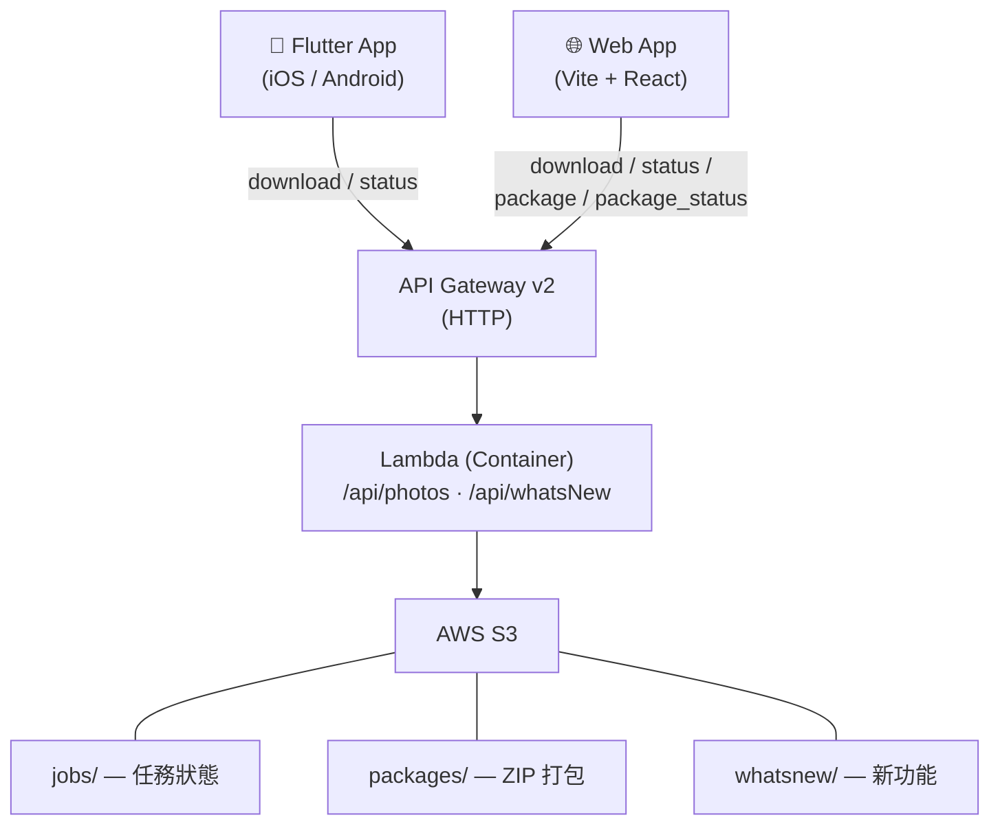

# Naver Blog Image Downloader

輸入 Naver Blog 網址，自動擷取並批次下載文章中的所有照片。支援行動版 App（iOS/Android）與 Web 版，共用同一個 AWS Lambda 後端，後端採用 API Gateway v2 + 非同步 Polling 架構。

## 系統架構



## 為何採非同步 Polling

Lambda 執行 Playwright 爬蟲時間常超過 API Gateway 29 秒硬限制，因此改為三段式流程：

1. **Submit**：App `POST /api/photos` 帶 `action: "download"` + `blog_url`，Lambda 立即建立 S3 job → HTTP 202 + `job_id`
2. **背景執行**：Lambda 以 `_async_worker` 自呼叫，Playwright 抓圖、結果寫入 S3
3. **Polling**：App 每 3 秒一次 `POST /api/photos` 帶 `action: "status"` + `job_id`，最多 10 分鐘；完成時取回 `image_urls` 清單

## Monorepo 結構

```text
apps/mobile/   — Flutter iOS/Android app（詳見 apps/mobile/README.md）
apps/backend/  — Python AWS Lambda backend（詳見 apps/backend/README.md）
apps/web/      — Vite + React 19 + TypeScript Web app（詳見 apps/web/README.md）
docs/          — 專案級別文件與 GitHub Pages 素材
openspec/      — Spectra SDD specs 與 change proposals
```

## 快速開始

```bash
# Mobile
cd apps/mobile
flutter pub get
dart run build_runner build --delete-conflicting-outputs
flutter run --dart-define=API_STAGE=uat

# Backend
cd apps/backend
uv sync
make deploy   # 建 image → 推 ECR → 更新 Lambda

# Web
cd apps/web
pnpm install
pnpm dev      # 開發伺服器 http://localhost:5173
```

各元件的完整設定、部署流程與細節請參閱：

- [`apps/mobile/README.md`](apps/mobile/README.md)
- [`apps/backend/README.md`](apps/backend/README.md)
- [`apps/web/CLAUDE.md`](apps/web/CLAUDE.md)

## 技術棧速覽

| 元件    | 技術棧                                                     | 部署                           |
| ------- | ---------------------------------------------------------- | ------------------------------ |
| Mobile  | Flutter + Riverpod 3.x + GoRouter + Dio + Firebase         | App Store / Play Store         |
| Backend | Python 3.10+ + Playwright + uv + Docker                    | AWS Lambda (Container) + ECR   |
| Web     | Vite + React 19 + React Router v7 + Zustand + Tailwind 4   | GitHub Pages（靜態檔）         |

## 版號管理與發布流程

各元件獨立管理 semver，CD workflow 依 version 檔案產生對應 tag 與 GitHub Release：

| 元件    | Version 檔案                  | Tag 格式             | 未 bump 時的 CD 行為 |
| ------- | ----------------------------- | -------------------- | -------------------- |
| mobile  | `apps/mobile/pubspec.yaml`    | `mobile-v<version>`  | Skip（notice）       |
| backend | `apps/backend/pyproject.toml` | `backend-v<version>` | Fail                 |
| web     | `apps/web/package.json`       | `web-v<version>`     | Skip（notice）       |

`<version>` 只取 semver 三段（mobile 自動去掉 `+buildNumber` 後綴）。每次發版前須先 bump 對應元件的 version 檔案。

## CI/CD（GitHub Actions）

各元件皆有獨立的 CI/CD workflow，CI 成功後自動觸發 CD。Release Notes 統一透過 Ollama Cloud API（`gemma4:31b-cloud`）生成正體中文內容，AI 失敗時 fallback 至原始 commit log。

| Workflow | 觸發條件 | 說明 |
|----------|----------|------|
| Mobile CI | `apps/mobile/**` 變動 | Flutter analyze + format 檢查 |
| Mobile CD | Mobile CI 成功 | 建立 git tag + GitHub Release |
| Backend CI | `apps/backend/**` 變動 | Ruff lint + format 檢查 |
| Backend CD | Backend CI 成功 | Docker build → ECR push → Lambda 更新 → git tag + Release |
| Web CI | `apps/web/**` 變動 | TypeScript 檢查 + Vitest 測試 + Vite build + Prettier 格式檢查 |
| Web CD | Web CI 成功 | 建立 git tag + GitHub Release（僅版號管理，不部署） |
| Deploy Pages | `docs/**` 或 `apps/web/**` 變動 | Build web app + 驗證圖片引用 → 部署至 GitHub Pages |

## 開發規範與共用準則

所有跨元件的開發準則（正體中文註解、Conventional Commits、Spectra SDD 流程）集中於 [CLAUDE.md](CLAUDE.md)。各元件專屬規則在各自 `apps/<name>/CLAUDE.md`。
